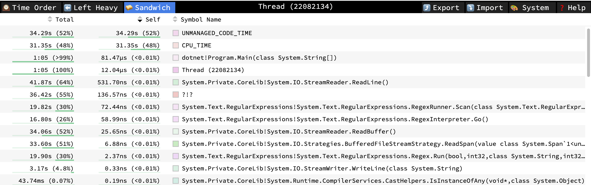
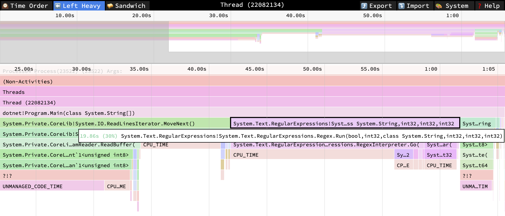

# dotnet

## Installation

```sh
brew install --cask dotnet-sdk
dotnet --list-runtimes
dotnet --list-sdks

dotnet tool install --global dotnet-trace -a arm64
```

## Building / Running

```sh
dotnet run ../../data/input.txt ../../data/dotnet.txt

dotnet build --configuration Release
```

## Tracing

```sh
dotnet-trace collect --output trace --format Chromium -- ./bin/Release/net6.0/dotnet ../../data/input.txt ../../data/dotnet.txt
dotnet-trace collect --output trace --format Speedscope -- ./bin/Release/net6.0/dotnet ../../data/input.txt ../../data/dotnet.txt
```

For `Chromium` trace format, in Chrome navigate to: [chrome://tracing/](chrome://tracing/)

For `Speedscope` trace format, navigate to: https://www.speedscope.app/

I recommend Speedscope!



